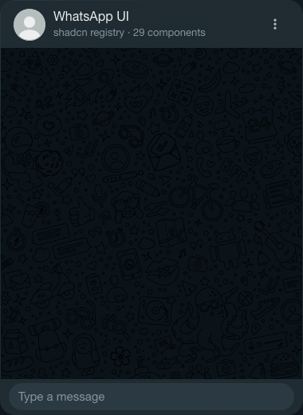

# WA UI

> A shadcn/ui registry of WhatsApp Web components, built directly on WhatsApp's WDS design tokens.

If you're building on top of WhatsApp — whether it's a SaaS platform, a customer support tool, or a Meta Cloud API integration — you shouldn't have to rebuild the UI from scratch. This registry gives you the exact same components, colors, and spacing that WhatsApp uses, ready to drop into your React app with a single command.

<p align="center">
  
</p>

**[Demo](https://ui.meta-cloud-api.site)** · **[Registry](https://ui.meta-cloud-api.site/r/registry.json)**

---

## Install

```bash
npx shadcn@latest add https://ui.meta-cloud-api.site/r/chat-bubble.json
```

Each component is independent — install only what you need.

---

## What's included

| Component | |
|---|---|
| `chat-bubble` | Text messages, group chat, reactions, read receipts, message tail |
| `chat-header` | Contact name, avatar, online status, action buttons |
| `chat-list-item` | Sidebar row with unread badge, mute/pin, delivery status |
| `message-input` | Compose bar with emoji, attachment, auto-resize, send/voice |
| `template-bubble` | Meta Business templates — URL, phone, copy_code, flow, OTP, catalog |
| `carousel-template` | Horizontal product cards (Meta carousel template) |
| `call-permission` | Calling permission request with bottom sheet |
| `image-bubble` | Single image, 2×2 grid, video with play overlay |
| `voice-message-bubble` | Waveform, progress, real `<audio>` playback, avatar |
| `file-attachment-bubble` | File type badge, progress bar, native download |
| `reaction-pill` | Emoji reactions — 1:1 and group modes |
| `typing-indicator` | Animated three-dot indicator |
| `date-separator` | Date pill between message groups |
| `action-button` | Outlined pill CTA button |
| `chat-menu` | Context dropdown with animated popup |
| `message-bubble` | Wrapper that attaches reactions to any bubble type |

---

## Design system

Every component uses the **WDS (WhatsApp Design System)** tokens — the same CSS variables that WhatsApp Web ships. Colors, spacing, border radii, and typography are all sourced directly from WDS, with both light and dark mode variants.

See [`DESIGN.md`](./DESIGN.md) for the full token reference.

---

## Stack

- **Tailwind CSS v4** — utility classes mapped to WDS tokens
- **@base-ui/react** — accessible primitives (Button, Toggle, Menu, Drawer…)
- **shadcn/ui registry** — install with `npx shadcn add`

---

## License

[MIT](./LICENSE) · [Contributing](./CONTRIBUTING.md)
